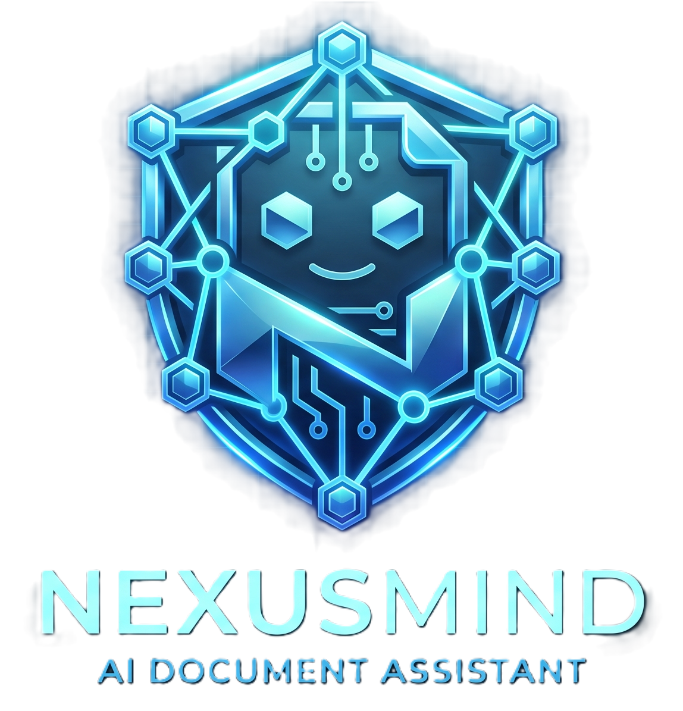
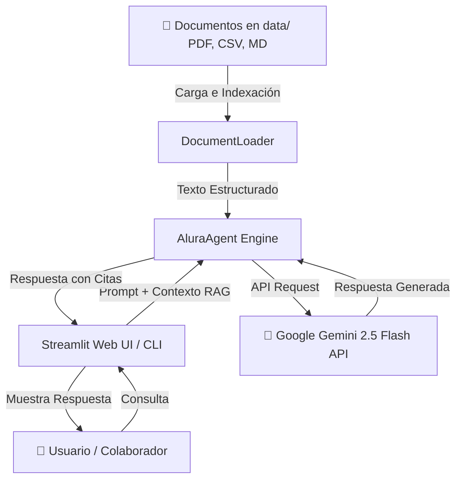
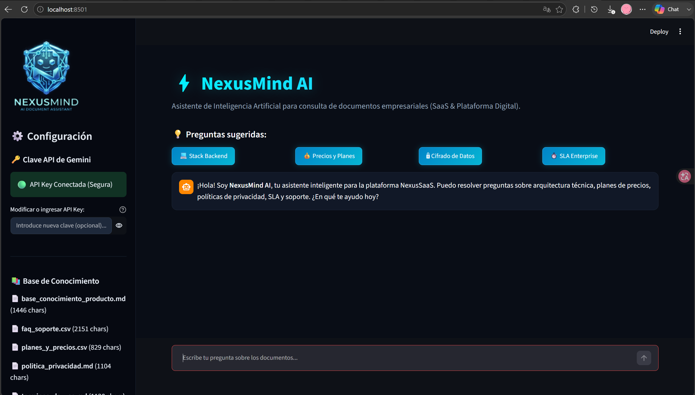
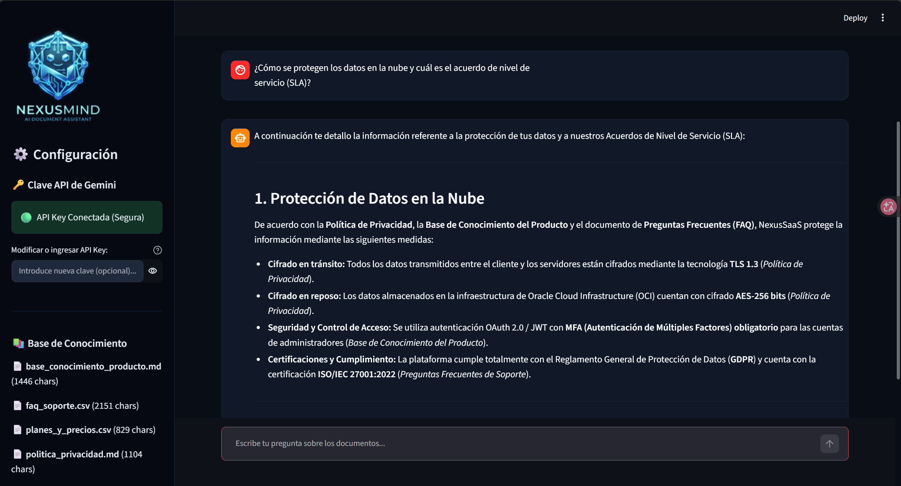

<p align="center">
  
</p>

# ⚡ NexusMind AI - Asistente Inteligente de Documentación (RAG)

[](https://www.python.org/downloads/)
[](https://aistudio.google.com/)
[](https://streamlit.io/)
[](https://www.oracle.com/cloud/)

---

## 📌 Descripción General

**Alura Agente** es un agente de Inteligencia Artificial desarrollado para resolver la problemática de búsqueda y consulta de información en grandes volúmenes de documentos empresariales (manuales, hojas de cálculo CSV, informes en PDF y políticas internas).

La solución permite a cualquier colaborador realizar preguntas en lenguaje natural a través de una interfaz interactiva o CLI y recibir respuestas precisas y estructuradas en segundos, indicando la fuente de los documentos consultados.

---

## 🏗️ Arquitectura de la Solución



---

## 🛠️ Tecnologías Utilizadas

- **Lenguaje**: Python 3.10+
- **Modelo de Lenguaje (LLM)**: Google Gemini 2.5 Flash via `google-genai` SDK
- **Procesamiento de Documentos**: `pypdf` (para archivos PDF), `pandas` (para tablas CSV y Markdown)
- **Interfaz Web**: Streamlit
- **Control de Versiones**: Git / GitHub
- **Infraestructura Cloud**: Oracle Cloud Infrastructure (OCI Compute Instance)

---

## 📂 Estructura del Repositorio

```text
.
├── data/                         # Base de conocimiento (PDF, CSV, MD)
│   ├── base_conocimiento_producto.md
│   ├── faq_soporte.csv
│   ├── planes_y_precios.csv
│   ├── politica_privacidad.md
│   └── terminos_de_uso.md
├── src/                          # Código fuente modular del Agente
│   ├── __init__.py
│   ├── agent.py                  # Motor del Agente IA y RAG
│   ├── config.py                 # Gestión de variables de entorno
│   └── document_loader.py        # Procesador de PDFs, CSVs y Markdowns
├── app.py                        # Aplicación Web principal con Streamlit
├── cli.py                        # Consola interactiva para pruebas rápidas
├── requirements.txt              # Dependencias de Python
├── .env.example                  # Plantilla de variables de entorno
├── .gitignore                    # Exclusiones de control de versiones
├── Instrucciones.md              # Requisitos del Challenge Alura
├── Entregable.md                 # Lista de verificaciones de entrega
└── README.md                     # Documentación oficial del proyecto
```

---

## ⚡ Instrucciones de Instalación y Ejecución Local

### 1. Clonar el repositorio
```bash
git clone https://github.com/carmenNieves6478/alura-agente-ia.git
cd alura-agente-ia
```

### 2. Crear y activar entorno virtual
```bash
python -m venv .venv
# En Windows (PowerShell):
.\.venv\Scripts\Activate.ps1
# En Linux/macOS:
source .venv/bin/activate
```

### 3. Instalar dependencias
```bash
pip install -r requirements.txt
```

### 4. Configurar clave API de Gemini
Copia el archivo de ejemplo `.env.example` a `.env` e ingresa tu API Key de Google Gemini:
```env
GEMINI_API_KEY=tu_api_key_aqui
```

### 5. Ejecutar la Aplicación Web
```bash
streamlit run app.py
```
Abre tu navegador en `http://localhost:8501`.

---

## 📸 Capturas de la Aplicación

<p align="center">
  
  <br><em>Interfaz Principal de NexusMind AI con tema oscuro y celeste neón.</em>
</p>

<p align="center">
  
  <br><em>Respuesta generada por el agente en lenguaje natural basada en los documentos.</em>
</p>

---

## 💬 Ejemplos de Preguntas y Respuestas

### Ejemplo 1: Stack Tecnológico Backend
- **Pregunta**: `¿Qué lenguajes de programación se usan en el backend de la plataforma?`
- **Respuesta del Agente**:
  > *Según la Base de Conocimiento del Producto (`base_conocimiento_producto.md`), el backend utiliza:*
  > - **Python (FastAPI)**: Para servicios de Inteligencia Artificial y procesamiento asíncrono.
  > - **Node.js (NestJS)**: Para la API principal de microservicios.

### Ejemplo 2: Planes y Límites de API
- **Pregunta**: `¿Cuáles son los precios y límites de peticiones de la API?`
- **Respuesta del Agente**:
  > *De acuerdo con la tabla de Planes y Precios (`planes_y_precios.csv`):*
  > - **Plan Gratuito ($0/mes)**: 2 usuarios, límite de 60 peticiones/minuto API, 5 GB almacenamiento.
  > - **Plan Pro ($29/mes)**: 10 usuarios, límite de 600 peticiones/minuto API, 50 GB almacenamiento.
  > - **Plan Enterprise ($199/mes)**: Usuarios ilimitados, 3000 peticiones/minuto API, 500 GB almacenamiento y soporte dedicado 24/7.

### Ejemplo 3: SLA y Tiempos de Respuesta
- **Pregunta**: `¿Cuál es el tiempo de respuesta garantizado para el soporte técnico?`
- **Respuesta del Agente**:
  > *Según la información de Soporte (`faq_soporte.csv`) y Términos de Uso (`terminos_de_uso.md`):*
  > - Plan Gratuito: 24-48 horas.
  > - Plan Pro: Menos de 4 horas.
  > - Plan Enterprise: Atención prioritaria 24/7 con SLA garantizado de 15 minutos y disponibilidad del servicio de 99.9%.

---

## ☁️ Evidencia de Deploy en la Nube (Render / OCI)

La aplicación está lista para ser desplegada en la nube mediante **Render.com** / **OCI Compute**, garantizando alta disponibilidad 24/7.

- **Enlace de la aplicación desplegada**: `https://alura-agente-ia.onrender.com` (o enlace asignado por Render).

---

## 📄 Licencia

Este proyecto se distribuye bajo la licencia MIT.
Desarrollado como parte del **Challenge Alura Agente - Oracle Next Education (ONE)**.
